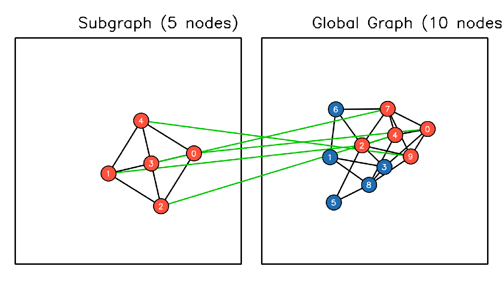

# RRWM Graph Matching Implementation in C++

This repository contains a C++ implementation of the **Reweighted Random Walks for Graph Matching (RRWM)** algorithm, as proposed by Cho et al. (ECCV 2010).

The project solves the graph matching problem using an affinity matrix, reconstructs the graph topology, and provides a high-resolution, force-directed visualization of the matching results using **OpenCV**.

## 📖 Paper Reference
**Reweighted Random Walks for Graph Matching**  
Minsu Cho, Jungmin Lee, and Kyoung Mu Lee  
*European Conference on Computer Vision (ECCV), 2010*

## ✨ Features

*   **RRWM Algorithm**: Full implementation including affinity-preserving random walks, inflation reweighting, and Sinkhorn bistochastic normalization.
*   **Topology Reconstruction**: Automatically reconstructs graph structures (edges and nodes) from a given Affinity Matrix ($K$).
*   **Force-Directed Layout**: Implements the Fruchterman-Reingold algorithm to visualize graph nodes aesthetically.
*   **Visualization**:
    *   High-resolution rendering (2000x1200).
    *   Side-by-side comparison of Subgraph and Global Graph.
    *   Visualizes matching correspondences with connecting lines.
    *   Color-coded nodes (Orange for matches/subgraph, Blue for unmatched).

## 🖼️ Results

Below is a visualization result generated by the algorithm. It shows the **Subgraph** (left) successfully matched to the corresponding nodes in the **Global Graph** (right).



*   **Green Lines**: Indicate the correspondences found by RRWM.
*   **Orange Nodes**: Matched nodes (the subgraph pattern found within the global graph).
*   **Blue Nodes**: Unmatched nodes in the global graph.

## 🛠️ Dependencies

*   **C++ Compiler** (supporting C++11 or later)
*   **OpenCV** (Version 4.x recommended)
*   **CMake** (Optional, if building with the provided instructions below)

## 🚀 Getting Started

### 1. Clone the Repository
```bash
git clone https://github.com/lzm-bit/RRWM.git
cd RRWM
```

### 2. Build the Project
```
mkdir build && cd build 
make -j 
```

### 3. Run the Application
```
./rrwm_matching
```

## ⚙️ Configuration

The current implementation is tuned for specific graph sizes based on the provided dataset. To adapt it for other graphs, modify the **n_global** and **n_sub** variables in the main function:

```
int n_global = 10; // Number of nodes in the larger graph
int n_sub = 5;     // Number of nodes in the subgraph
```
